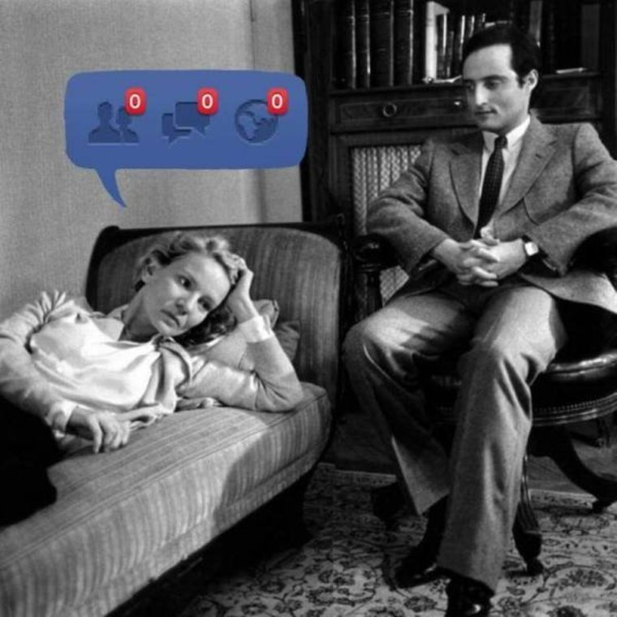

# Vocabulary {data-background="./data-culture_files/img/Freud.png"}

<aside class="notes">
Oh hey, these are some notes. They'll be hidden in your presentation, but you can see them if you open the speaker notes window (hit 's' on your keyboard).
</aside>

----

<!--
<video width="480" height="480" loop=false autoplay=true>
  <source src="data-culture_files/img/ubisoft.mp4" type="video/mp4">
</video> 
-->

 
  

<aside class="notes">
- Note that this is all from the viewpoint of a large, multinational company
- very data-keen, and data-open management
</aside>

## Culture

> (2) The ideas, customs, and social behaviour of a particular people or society  
>   
> [OED definition](https://en.oxforddictionaries.com/definition/culture)

## Data

<video width="480" height="480" loop=true autoplay=true>
  <source src="data-culture_files/img/different-faces-of-david-bowie.mp4" type="video/mp4">
</video> 

<small>by [Helen Green](http://dollychops.tumblr.com/image/107517113745)</small>

# Situation {data-background="./data-culture_files/img/business-rabbid.png"}

## What should data be used for?

- learn from past mistakes and successes
- make correct predictions for the future
- *not* to check the present!

<aside class="notes">
- checking the present is monitoring
- BUT: we will see that this drives behaviour towards the KPIs
- doctors with "track records" refuse to operate on older patients
</aside>

## Data (mis-)use 

- metrics and KPIs drive behaviour
- data as substitute for a trusted opinion
    - avoid "endless KPI treadmill"
    - "illusion of control"

<aside class="notes">
Rather than rely on the informed judgment of people familiar with the situation, we gather meaningless numbers at great cost. 
metrics/KPIs: 
- 4Ts: teaching to the test
- make forecasting ubiquitous (Twitch forecasting)
</aside>

## Responsibility

<small>https://xkcd.com/643/</small>

***

- know KPIs, data, and what they mean
- understand the implications of them! 
    - (pretty is powerful)
- teach your organisation data skills
- use your data power wisely (this will never happen...)
    - principal-agent theory

<aside class="notes">
https://medium.com/airbnb-engineering/democratizing-data-at-airbnb-852d76c51770
</aside>

***

data culture means using other people's data! 

<aside class="notes">
- know their viewpoints
- know their problems
- know their strengths
</aside>

# Action plan {data-background="./data-culture_files/img/actionplan-rabbid.png"}

## get experts on board

## learn from mistakes 

<aside class="notes">
difficult, als decision-making is intransparent
</aside>

## you'll never reach understanding

<aside class="notes">
https://medium.com/airbnb-engineering/how-airbnb-democratizes-data-science-with-data-university-3eccc71e073a
</aside>

## understand human behaviour

<aside class="notes">
- ranking changes efforts! (mechanism design)
- we’re a gaming company – we should be really good at this! 
- metrics drive behavior towards the KPI!
</aside>

## metrics aid decision-making, not short-cut it!

<aside class="notes">
- (producer traffic lights)
- us analysts always use metrics for decision-making in areas we have little expertise
</aside>

- be humble
- use other people's data: you'll understand their problems and viewpoints
- don't lose the holistic view

# Thanks! {data-background="./data-culture_files/img/Hanging_Rabbid.png"}

<aside class="notes">
https://www.amazon.co.uk/Tyranny-Metrics-Jerry-Z-Muller
</aside>

## Contact me

christoph.safferling@ubisoft.com  
github: <a href="https://github.com/safferli/data-culture">@safferli/data-culture</a>  

