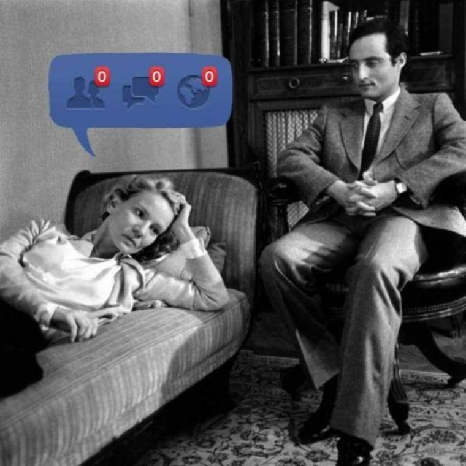

## Data (mis-)use 

- metrics/KPIs 
    - make forecasting ubiquitous (Twitch forecasting)
- avoid "endless KPI treadmill"
- "illusion of control"

--- &vertical

## Responsibility

<small>https://xkcd.com/643/</small>

***

- know KPIs, data, and what they mean
- understand the implications of them! 
    - (pretty is powerful)

<!--
https://medium.com/airbnb-engineering/democratizing-data-at-airbnb-852d76c51770
-->

--- &vertical

## Action plan 

***""

### get experts on board

***

### learn from mistakes 

<!--
difficult, als decision-making is intransparent
-->

***

### don't be deluded into thinking you have reached understanding

<!--
https://medium.com/airbnb-engineering/how-airbnb-democratizes-data-science-with-data-university-3eccc71e073a
-->

***

### understand human behaviour

ranking changes efforts! (mechanism design)

***

### metrics aid decision-making, not short-cut it!

<!--
(producer traffic lights)
-->

